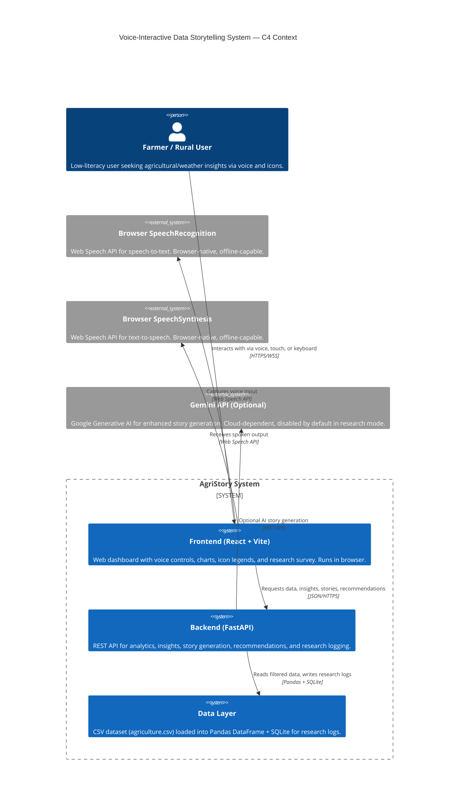
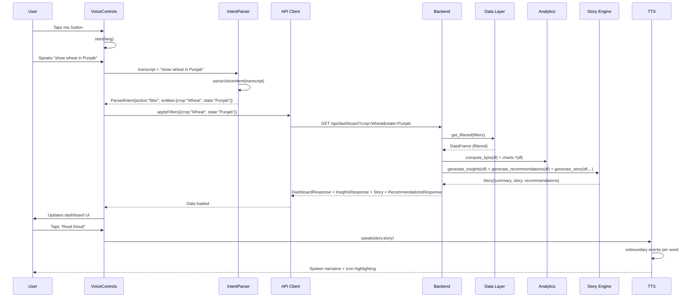

# Technical Architecture Plan: Voice-Interactive Data Storytelling System

## Goal

Define the component architecture, data flow, API boundaries, and fallback mechanisms for the existing system. This plan must be implementation-ready: an agent should be able to read it and know exactly what each layer does, how it connects, and what the failure/fallback contract is.

---

## 1. Current Architecture Summary (What Exists)

| Layer | Current Implementation | File(s) |
|---|---|---|
| Frontend | React + Vite + TypeScript + Tailwind + Plotly | `frontend/src/` |
| Voice Input | Web Speech API (`SpeechRecognition`) | `frontend/src/hooks/use-voice-input.ts` |
| Voice Output | Web Speech API (`speechSynthesis`) | `frontend/src/hooks/use-voice-output.ts` |
| NLU / Intent Parsing | Client-side regex/token matching | `frontend/src/lib/voice-intents.ts` |
| Data Layer | CSV → Pandas DataFrame (in-memory) | `backend/database/data.py` |
| Analytics | Pandas + rule-based KPIs | `backend/analytics/engine.py`, `charts.py` |
| Story Generation | Rule-based + optional Gemini | `backend/insights/engine.py` |
| Visualization | Plotly.js charts + custom SVG icons | `frontend/src/components/charts/`, `lib/icons/` |
| Logging | SQLite (`task_logs`, `survey_responses`) | `backend/database/db.py` |
| API | FastAPI REST (JSON) | `backend/api/routes.py` |

---

## 2. Layered Architecture Definition

### 2.1 Layer Diagram (Conceptual)

```
┌─────────────────────────────────────────────────────────────┐
│                        PRESENTATION LAYER                    │
│  React Dashboard + Plotly Charts + SVG Icon System          │
├─────────────────────────────────────────────────────────────┤
│                      VOICE INTERFACE LAYER                   │
│  useVoiceInput (STT) + useVoiceOutput (TTS) + VoiceControls │
├──────────────┬──────────────────────────────────────────────┤
│   CLIENT     │                  SERVER                       │
├──────────────┼──────────────────────────────────────────────┤
│              │              API BOUNDARY                      │
│  Intent      │            FastAPI Router                     │
│  Parser      │            (routes.py)                       │
│  (voice-     │                                              │
│  intents.ts) │              ┌──────────────┐                │
│              │              │ DATA LAYER   │                │
│              │              │ data.py      │                │
│              │              │ (CSV loader, │                │
│              │              │  filter,     │                │
│              │              │  cache)      │                │
│              │              └──────┬───────┘                │
│              │                     │                         │
│              │              ┌──────▼───────┐                │
│              │              │ ANALYTICS    │                │
│              │              │ engine.py    │                │
│              │              │ (KPIs,       │                │
│              │              │  charts)     │                │
│              │              └──────┬───────┘                │
│              │                     │                         │
│              │              ┌──────▼───────┐                │
│              │              │ INSIGHTS /   │                │
│              │              │ STORY GEN    │                │
│              │              │ engine.py    │                │
│              │              └──────┬───────┘                │
│              │                     │                         │
│              │              ┌──────▼───────┐                │
│              │              │ LOGGING      │                │
│              │              │ db.py        │                │
│              │              │ (SQLite)     │                │
│              │              └──────────────┘                │
└──────────────┴──────────────────────────────────────────────┘
```

---

## 3. Component Responsibility Table

| Component | Responsibility | Technology | Location |
|---|---|---|---|
| **Frontend Shell** | Routing, layout, theme, error boundary | React 18, Vite, Tailwind | `frontend/src/App.tsx` |
| **Dashboard Page** | Main container, condition switcher, task palette, survey trigger | React, `use-dashboard.ts` | `frontend/src/pages/dashboard-page.tsx` |
| **Charts** | Plotly-based visualization (line, bar, scatter, heatmap, pie) | Plotly.js | `frontend/src/components/charts/` |
| **Icon System** | Shape-first, color-independent SVG icons | Custom SVG (24×24 stroke-based) | `frontend/src/lib/icons/` |
| **IconAnchor** | TTS-synced highlighting with accessibility | React + `useReducedMotion` | `frontend/src/components/icon-anchor.tsx` |
| **Voice Controls** | Mic button, language selector, help modal, confirmation/clarification UI | React + Web Speech API | `frontend/src/components/voice-controls.tsx` |
| **useVoiceInput** | STT wrapper, context buffer, confirmation/clarification state | `SpeechRecognition` | `frontend/src/hooks/use-voice-input.ts` |
| **useVoiceOutput** | TTS wrapper, utterance queue, word-boundary callbacks, response trimming | `speechSynthesis` | `frontend/src/hooks/use-voice-output.ts` |
| **Voice Intents** | Intent parsing, entity extraction, context resolution, confidence scoring | TypeScript (regex + token matching) | `frontend/src/lib/voice-intents.ts` |
| **API Client** | Axios instance, error interception, timeout | Axios | `frontend/src/services/api.ts` |
| **Dashboard Hook** | State management for filters, data loading, abort controller | React hooks | `frontend/src/hooks/use-dashboard.ts` |
| **FastAPI App** | HTTP server, middleware (CORS, rate limit), exception handling | FastAPI, Uvicorn | `backend/main.py` |
| **Routes** | REST endpoint definitions, request/response models | FastAPI APIRouter | `backend/api/routes.py` |
| **Schemas** | Pydantic request/response validation | Pydantic | `backend/models/schemas.py` |
| **Data Loader** | CSV ingestion, column normalization, DataFrame caching, filtering | Pandas | `backend/database/data.py` |
| **Analytics Engine** | KPI computation, chart data transformation | Pandas, NumPy | `backend/analytics/engine.py`, `charts.py` |
| **Insights Engine** | Rule-based trend/anomaly/comparison detection, story generation | Pandas | `backend/insights/engine.py` |
| **Recommendations Engine** | Rule-based action recommendations | Pandas | `backend/recommendations/engine.py` |
| **Gemini Client** | Optional AI story generation (cloud LLM) | Google Generative AI SDK | `backend/insights/gemini.py` |
| **Database** | SQLite for insight history, task logs, survey responses | SQLite3 | `backend/database/db.py` |
| **Export** | PDF/JSON report generation | ReportLab | `backend/api/export.py` |
| **Logging** | Structured logging | Python `logging` | `backend/core/logging.py` |
| **Config** | Environment-based settings | Pydantic Settings | `backend/core/config.py` |

---

## 4. Component Interfaces

### 4.1 Frontend → Backend API

All endpoints are prefixed with `/api`. Request/response models are defined in `backend/models/schemas.py`.

| Method | Endpoint | Request | Response | Purpose |
|---|---|---|---|---|
| GET | `/api/health` | — | `{status, app}` | Liveness check |
| GET | `/api/dataset/status` | — | `{loaded, rows, columns}` | Dataset metadata |
| GET | `/api/filters` | — | `{crop, state, district, date_min, date_max}` | Available filter values |
| GET | `/api/dashboard` | `DashboardFilters` (query) | `DashboardResponse` | KPIs + charts + filters |
| GET | `/api/insights` | `DashboardFilters` (query) | `InsightsResponse` | Generated insights |
| GET | `/api/story` | `DashboardFilters` (query) | `Story` | Narrative story |
| GET | `/api/recommendations` | `DashboardFilters` (query) | `RecommendationsResponse` | Action recommendations |
| POST | `/api/export` | `DashboardFilters` (body), `format` (query) | `Response` (PDF/JSON blob) | Report export |
| POST | `/api/research/task-log` | `TaskLog` (body) | `{status}` | Research task logging |
| POST | `/api/research/survey` | `SurveyResponse` (body) | `{status}` | Survey submission |
| GET | `/api/research/condition` | `condition` (query) | `{condition}` | Condition retrieval |

**Error contract**: All errors return `{"detail": "message"}` with appropriate HTTP status codes. Frontend `ApiError` class normalizes this.

### 4.2 Voice Input Interface

```typescript
// frontend/src/hooks/use-voice-input.ts
interface VoiceInputState {
  isListening: boolean
  transcript: string
  interimTranscript: string
  error: string | null
  isSupported: boolean
  context: ConversationContext
  confirmation: ConfirmationState
  clarification: ClarificationState
}

interface VoiceInputAPI {
  start(lang?: string): void
  stop(): void
  handleIntent(intent: ParsedIntent): void
  resetContext(): void
}
```

### 4.3 Voice Output Interface

```typescript
// frontend/src/hooks/use-voice-output.ts
interface VoiceOutputState {
  isSpeaking: boolean
  isSupported: boolean
  voices: SpeechSynthesisVoice[]
  selectedVoice: SpeechSynthesisVoice | null
  setVoice: (voice: SpeechSynthesisVoice) => void
  speak(text: string, lang?: string, policy?: Partial<VoiceResponsePolicy>): void
  enqueue(text: string, lang?: string): void
  cancel(): void
  pause(): void
  resume(): void
  queue: string[]
  currentWordIndex: number
  onWordBoundary: (index: number) => void
}
```

### 4.4 Intent Parser Interface

```typescript
// frontend/src/lib/voice-intents.ts
interface ParsedIntent {
  action: "filter" | "reset" | "query" | "read_aloud" | "stop" | ... | "unknown"
  entities: { crop?, state?, district?, startDate?, endDate?, metric?, comparison? }
  raw: string
  confidence: number
  needsConfirmation: boolean
  clarificationOptions?: string[]
}

function parseVoiceIntent(transcript: string, context?: ConversationContext): ParsedIntent
function resolveContext(entities: ParsedIntent["entities"], context: ConversationContext): ConversationContext
```

### 4.5 Data Layer Interface

```python
# backend/database/data.py
def _load_dataset() -> pd.DataFrame  # cached, idempotent
def get_dataset() -> pd.DataFrame
def get_filtered(filters: dict) -> pd.DataFrame
def get_filter_options() -> FilterOptions
```

### 4.6 Analytics Interface

```python
# backend/analytics/engine.py
def compute_kpis(df: pd.DataFrame) -> list[KPI]

# backend/analytics/charts.py
def line_chart(df: pd.DataFrame) -> dict
def bar_chart(df: pd.DataFrame) -> dict
def scatter_chart(df: pd.DataFrame) -> dict
def heatmap_data(df: pd.DataFrame) -> dict
def pie_chart(df: pd.DataFrame) -> dict
```

### 4.7 Insights/Story Interface

```python
# backend/insights/engine.py
def generate_insights(df: pd.DataFrame) -> list[Insight]
def generate_story(df: pd.DataFrame, insights: list[Insight], recommendations: list[dict]) -> dict

# backend/recommendations/engine.py
def generate_recommendations(df: pd.DataFrame) -> list[Recommendation]
```

### 4.8 Logging Interface

```python
# backend/database/db.py
def record_insight_run(filters: dict, insights: list, story: str = "") -> None
def record_task_log(task: dict) -> None
def record_survey_response(survey: dict) -> None
```

---

## 5. Data Flow

### 5.1 Primary Data Flow (Dashboard Load)

```
1. Frontend mounts
2. useDashboard() loads filters via GET /api/filters
3. useDashboard() calls GET /api/dashboard, /api/insights, /api/recommendations, /api/story in parallel
4. Backend:
   a. data.get_filtered(filters) → Pandas DataFrame
   b. compute_kpis(df) → KPI list
   c. charts.*(df) → chart data dicts
   d. generate_insights(df) → insight list
   e. generate_recommendations(df) → rec list
   f. generate_story(df, insights, recs) → story dict
   g. record_insight_run() → SQLite
5. Frontend renders KPIs, charts, insights, story, recommendations
```

### 5.2 Voice Interaction Data Flow

```
1. User taps mic button
2. useVoiceInput.start(lang) → SpeechRecognition.start()
3. User speaks → interim + final transcripts
4. parseVoiceIntent(transcript, context) → ParsedIntent
5. onIntent(intent) dispatched to dashboard
6. If intent.action === "filter":
   → applyFilters(entities) → reload dashboard
7. If intent.needsConfirmation:
   → VoiceConfirmation UI shown
   → User says "yes" → confirm action
   → User says "no" → cancel action
8. If intent.clarificationOptions:
   → VoiceClarification UI shown
   → User selects option → proceed
9. If intent.action === "read_aloud":
   → useVoiceOutput.speak(story.story)
   → onWordBoundary → setActiveIcon → IconLegend highlights
```

### 5.3 Research Data Flow

```
1. User selects condition (conventional / voice-only / voice-icons / voice-story)
2. Condition persisted in localStorage
3. User completes task → useTaskLogger.completeTask()
4. POST /api/research/task-log {task_id, condition, user_id, completed, duration_ms, voice_used}
5. After 3 tasks → SurveyModal shown
6. User completes survey → POST /api/research/survey {condition, user_id, scores, feedback}
7. Backend stores in SQLite (task_logs, survey_responses)
```

---

## 6. Failure Points and Fallback Mechanisms

| Failure Point | Impact | Fallback | Detection |
|---|---|---|---|
| **CSV dataset missing or corrupt** | Dashboard cannot load | ErrorBoundary shows "No data available"; backend returns 500 with detail | `test_dataset_status`, backend health check |
| **Backend API down** | All data operations fail | Frontend shows error banner with retry button; voice controls still functional locally | `use-dashboard.ts` catch block, `ApiError` |
| **STT permission denied** | Voice input unavailable | Voice controls hidden; user falls back to manual filters | `use-voice-input.ts` `not-allowed` error |
| **STT unsupported language** | Recognition fails or uses wrong language | Fallback to English; toast notification shown | `voice-controls.tsx` language check |
| **TTS voice not available** | Narration silent | UI still updates; no audio feedback; icons still highlight | `use-voice-output.ts` `isSupported` check |
| **Gemini API key missing/invalid** | AI story generation fails | Transparent fallback to rule-based story; footer shows "Rule-based analysis" | `insights/engine.py` try/except |
| **Network loss after initial load** | API calls fail | Cached dataset in memory; voice APIs work offline in Chrome/Edge | Browser offline event |
| **Rate limit exceeded** | API returns 429 | Frontend shows "Too many requests" message; user waits | `RateLimitMiddleware` |
| **Invalid filter values** | No data returned | "No data found for [filter]" message; insights show info-level message | `test_insights_no_data` |
| **Speech recognition timeout** | No transcript captured | System remains in listening state; no error shown (by design for `no-speech`) | `use-voice-input.ts` `no-speech` handler |
| **Icon rendering failure** | Visual anchors missing | Text labels remain; functionality not blocked | React error boundary |
| **Survey submission failure** | Research data lost | Local retry queue (future); current: silent catch | `handleSurveyComplete` catch |

---

## 7. Technology Justification

### 7.1 Frontend Framework: React + Vite

**Chosen:** React 18 + Vite + TypeScript

**Justification:**
- React's component model maps directly to our UI requirements (charts, panels, voice controls, modals).
- Vite provides fast HMR and optimized production builds.
- TypeScript enforces type safety across the large frontend surface (hooks, components, API models).
- Existing codebase already uses this stack; changing would require full rewrite.

**Trade-offs:**
- Bundle size is large (4.9MB dashboard chunk). Mitigated by code splitting (future).
- React's state management is sufficient for our scope; no Redux/Zustand needed.

### 7.2 Charting: Plotly.js

**Chosen:** Plotly.js (via `react-plotly.js`)

**Justification:**
- Supports all 5 required chart types (line, bar, scatter, heatmap, pie) out of the box.
- Built-in responsiveness and accessibility attributes.
- Declarative API fits React well.

**Trade-offs:**
- Plotly is heavy (~3MB gzipped). For our research prototype, this is acceptable.
- Alternative: Chart.js or Recharts would be lighter but require more custom work for heatmap/scatter.

### 7.3 Voice Input: Web Speech API (Browser-Native STT)

**Chosen:** `window.SpeechRecognition` / `window.webkitSpeechRecognition`

**Justification:**
- Zero backend dependency; works offline in Chrome/Edge.
- Supports 8+ Indian languages (browser-dependent).
- Continuous recognition with interim results enables natural conversation.
- Free, no API keys, no usage limits.

**Trade-offs:**
- Not supported in Firefox or all Safari versions. Graceful degradation (hide voice UI).
- Accuracy varies by language and accent. Mitigated by intent parsing robustness and confirmation prompts.
- Requires user permission. Handled via error messages.

**Alternative considered:** OpenAI Whisper API. Rejected due to cost, latency, internet dependency, and privacy concerns for research participants.

### 7.4 Voice Output: Web Speech API (`speechSynthesis`)

**Chosen:** Browser-native `speechSynthesis`

**Justification:**
- Same as STT: zero backend, offline-capable, free.
- Supports multiple voices/languages.
- `onboundary` event enables word-level TTS sync with icon highlighting.

**Trade-offs:**
- Voice quality varies by OS/browser. Acceptable for research prototype.
- No streaming; entire utterance must be prepared. Mitigated by response length limits (60 words).
- `onboundary` is not supported in all browsers. Fallback: no icon highlighting, but voice still works.

**Alternative considered:** Google Cloud TTS, Amazon Polly. Rejected due to cost, latency, internet dependency.

### 7.5 Natural Language Understanding: Rule-Based Parser

**Chosen:** Client-side TypeScript intent parser (`voice-intents.ts`)

**Justification:**
- Deterministic, explainable, no external API calls.
- Sufficient for our constrained domain (agriculture/weather, 8 crops, 8 states).
- Fast (<1ms parse time), works offline.
- Easy to debug and extend during research iterations.

**Trade-offs:**
- Limited generalization. Cannot handle out-of-domain questions gracefully (handled via unknown-intent fallback).
- Requires manual maintenance of entity lists (crops, states, districts).

**Alternative considered:** Cloud NLU (Dialogflow, Lex). Rejected due to cost, latency, internet dependency, and complexity for a research prototype.
**Alternative considered:** Open-source LLM (Llama, Mistral) running locally. Rejected due to model size, GPU requirements, and latency.

### 7.6 Backend: FastAPI

**Chosen:** FastAPI + Uvicorn

**Justification:**
- Async support, automatic OpenAPI docs, Pydantic validation.
- High performance for data-heavy endpoints (Pandas + FastAPI is well-proven).
- Python ecosystem aligns with data science tools (Pandas, NumPy).
- Existing codebase already uses FastAPI.

**Trade-offs:**
- Single-process deployment limits concurrency. Mitigated with Gunicorn + Uvicorn workers (future).
- In-memory rate limiting (`RateLimitMiddleware`) is not distributed. Acceptable for single-instance research deployment.

### 7.7 Data Storage: CSV + Pandas + SQLite

**Chosen:** CSV for primary data, Pandas for analytics, SQLite for logging

**Justification:**
- CSV is human-readable, easy to edit, no database server required.
- Pandas is the de-facto standard for tabular analytics in Python.
- SQLite is embedded, zero-configuration, perfect for research logging.

**Trade-offs:**
- CSV load time scales linearly. 600 rows is trivial; 100K rows requires profiling (NFR-11).
- No concurrent writes to SQLite. Not a problem for single-user research.

**Alternative considered:** PostgreSQL. Rejected due to operational overhead for a research prototype.
**Alternative considered:** Parquet. Rejected because CSV is more accessible for collaborators.

### 7.8 Story Generation: Rule-Based + Optional Gemini

**Chosen:** Rule-based engine with optional Gemini fallback

**Justification:**
- Rule-based engine is deterministic, fast, offline-capable, and explainable.
- Gemini API provides higher-quality narratives when available (configurable via `AI_ENABLED` + `GEMINI_API_KEY`).
- Transparent fallback: if Gemini fails, rule-based story is used automatically.

**Trade-offs:**
- Rule-based stories are formulaic. Acceptable for MVRS research.
- Gemini requires internet and API key. Explicitly out of scope for core hypothesis testing.

### 7.9 Visualization: Custom SVG Icons

**Chosen:** Hand-crafted 24×24 stroke-based SVG components

**Justification:**
- Full control over shape-first semantics (no color-only meaning).
- Lightweight (~1KB per icon), no external dependency.
- `aria-label` built-in for accessibility.
- Animations via CSS/Tailwind respect `prefers-reduced-motion`.

**Trade-offs:**
- More maintenance than icon library (Lucide). But Lucide icons are color-dependent and not designed for agricultural metaphors.
- Custom icons require user validation (future co-design).

**Alternative considered:** Emoji. Rejected because rendering varies across platforms and they lack animation control.

---

## 8. Deployment Architecture

### 8.1 Current (Development)

```
┌─────────────┐     HTTP      ┌─────────────┐
│   Browser   │ ◄────────────► │  FastAPI    │
│  (Vite dev) │   localhost   │  (uvicorn)  │
└─────────────┘               └──────┬──────┘
                                     │ reads
                               ┌─────▼─────┐
                               │  CSV +    │
                               │  SQLite   │
                               └───────────┘
```

### 8.2 Production (Docker Compose)

```
┌─────────────┐     HTTP      ┌─────────────┐
│   Browser   │ ◄────────────► │  Nginx      │
│             │   :80          │  (frontend) │
└─────────────┘               └──────┬──────┘
                                     │ proxy /api
                               ┌─────▼─────┐
                               │  FastAPI  │
                               │  :8000    │
                               └─────┬─────┘
                                     │ reads
                               ┌─────▼─────┐
                               │  CSV +    │
                               │  SQLite   │
                               └───────────┘
```

### 8.3 Production (Vercel + Render)

```
┌─────────────┐     HTTPS     ┌─────────────┐
│   Browser   │ ◄────────────► │  Vercel    │
│             │   agristory    │  (frontend)│
└─────────────┘               └──────┬──────┘
                                     │ /api proxy
                               ┌─────▼─────┐
                               │  Render   │
                               │  (backend)│
                               └─────┬─────┘
                                     │ reads
                               ┌─────▼─────┐
                               │  CSV +    │
                               │  SQLite   │
                               └───────────┘
```

---

## 9. Mermaid Architecture Diagram



```mermaid
C4Container
    title Voice-Interactive Data Storytelling System — Container Diagram

    Container_Boundary(frontend, "Frontend") {
        Container(react_app, "React App", "TypeScript, Vite, Tailwind, Plotly", "Serves dashboard, charts, voice UI, icons, survey modal.")
        Container(voice_input, "useVoiceInput", "React Hook", "Wraps SpeechRecognition. Manages transcript, context, confirmation, clarification.")
        Container(voice_output, "useVoiceOutput", "React Hook", "Wraps speechSynthesis. Manages queue, rate, word-boundary callbacks.")
        Container(intent_parser, "Voice Intents", "TypeScript Module", "Parses transcripts into intents + entities. Resolves context.")
        Container(api_client, "API Client", "Axios", "HTTP client with error interception and timeout.")
    }

    Container_Boundary(backend, "Backend") {
        Container(fastapi_app, "FastAPI App", "Python, Uvicorn", "REST API with CORS, rate limiting, global exception handling.")
        Container(routes, "Routes", "FastAPI Router", "Endpoint definitions: dashboard, insights, story, recommendations, export, research.")
        Container(data_loader, "Data Loader", "Pandas", "CSV ingestion, column normalization, DataFrame caching, filtering.")
        Container(analytics, "Analytics Engine", "Pandas", "KPI computation, chart data transformation.")
        Container(insights, "Insights Engine", "Pandas", "Rule-based trend/anomaly detection, story generation, Gemini fallback.")
        Container(recommendations, "Recommendations Engine", "Pandas", "Rule-based action recommendations.")
        Container(db, "Database", "SQLite3", "Stores insight history, task logs, survey responses.")
    }

    Rel(react_app, voice_input, "Uses", "Local")
    Rel(react_app, voice_output, "Uses", "Local")
    Rel(voice_input, intent_parser, "Calls", "Local")
    Rel(react_app, api_client, "Uses", "Local")
    Rel(api_client, fastapi_app, "Calls", "HTTPS/JSON")
    Rel(fastapi_app, routes, "Dispatches to", "Local")
    Rel(routes, data_loader, "Queries", "Local")
    Rel(routes, analytics, "Computes KPIs/charts", "Local")
    Rel(routes, insights, "Generates insights/stories", "Local")
    Rel(routes, recommendations, "Generates recommendations", "Local")
    Rel(routes, db, "Logs research data", "Local")
    Rel(insights, gemini, "Optional AI story", "HTTPS")
```



---

## 10. Scalability and Evolution Path

### 10.1 Current Scale (MVRS)

- Single user, single device, static dataset (600 rows).
- Backend handles ~10 req/sec comfortably.
- Frontend bundle ~5MB (acceptable for research prototype).

### 10.2 Scaling to Production

| Dimension | Current | Production Target | Strategy |
|---|---|---|---|
| Dataset size | 600 rows | 100K+ rows | Profile Pandas; add columnar format (Parquet) or PostgreSQL if needed |
| Concurrent users | 1 | 100 | Gunicorn + Uvicorn workers; Redis rate limiting |
| Frontend bundle | ~5MB | <1MB initial | Code splitting, dynamic imports, lazy load charts |
| Data freshness | Static CSV | Daily updates | Scheduled CSV replacement; keep in-memory cache warm |
| Voice languages | 8 | 20+ | Add language codes to `LANGUAGES` array; validate browser support |
| Story quality | Rule-based | Hybrid rule + LLM | Keep Gemini as optional; add local small model (future) |
| Logging | SQLite | PostgreSQL | Switch `db.py` to PostgreSQL driver; schema remains same |

### 10.3 Decentralized Deployment (Offline-First)

For true rural deployment without internet:

1. **Frontend:** Add Service Worker for offline caching of app shell.
2. **Backend:** Package as desktop app (Tauri) or local server script.
3. **Data:** Bundle CSV with application; update via USB/SD card.
4. **Voice:** Browser-native APIs already work offline in Chrome/Edge.

This is **post-MVRS** and not required for the research hypothesis.

---

## 11. Security and Privacy Architecture

### 11.1 Threat Model

| Threat | Mitigation |
|---|---|
| Malicious CSV upload | Not supported in MVRS (no upload endpoint). Future: validate file type, size, schema. |
| SQL injection | Parameterized queries via SQLite3 + Pandas. No raw SQL concatenation. |
| XSS | React auto-escapes; Plotly sanitizes data. No `dangerouslySetInnerHTML`. |
| CORS bypass | `CORSMiddleware` with explicit origin whitelist. |
| Data exfiltration | No personal data collected. Voice transcripts not stored. |
| Rate limit evasion | IP-based rate limiting; future: token-based auth for production. |
| Prompt injection (if LLM added) | Input sanitization; output filtering; rule-based fallback. |

### 11.2 Privacy Architecture

```
┌─────────────┐
│   Browser   │
│             │
│  - No PII stored    │
│  - Voice not recorded (STT transcript only, not stored)    │
│  - User ID = random UUID in localStorage    │
│  - No cookies/tracking    │
└──────┬──────┘
       │ HTTPS
┌──────▼──────┐
│   Backend   │
│             │
│  - Anonymized task logs    │
│  - Anonymized survey responses    │
│  - No IP addresses stored    │
│  - No voice recordings    │
│  - Retention: 6 months (research policy)    │
└──────┬──────┘
       │
┌──────▼──────┐
│   SQLite    │
│             │
│  - task_logs (no PII)    │
│  - survey_responses (no PII)    │
│  - insight_history (anonymized)    │
└─────────────┘
```

---

## 12. Open Questions and Decisions

| Question | Recommendation | Status |
|---|---|---|
| Should we add a Service Worker for offline? | Yes, post-MVRS. Not needed for browser-native voice + in-memory dataset. | Deferred |
| Should we add user authentication? | No for MVRS. Research tool, single-user per device. | Out of scope |
| Should we migrate from CSV to a database? | No for MVRS. CSV is sufficient for 600 rows. Re-evaluate at 100K+ rows. | Monitor |
| Should we add a local LLM for NLU? | No for MVRS. Rule-based parser is deterministic and sufficient. | Deferred |
| Should we support Firefox? | Partial. Voice UI hides; dashboard works. | Acceptable limitation |
| Should we add E2E tests? | Yes, post-MVRS. Start with Playwright for critical paths. | Future |

---

## 13. Validation Plan

| Validation Activity | Target | Method |
|---|---|---|
| Backend API tests | 100% endpoint coverage | `pytest tests/test_api.py -v` |
| Frontend build | TypeScript clean, no warnings | `npm run build` |
| Voice flow test | All 20+ conversation examples | Manual + Wizard-of-Oz |
| Icon accessibility | All icons have aria-label | axe DevTools + manual inspection |
| Performance test | API p95 <500ms | Load test with 600-row dataset |
| Offline test | Core features work without internet | Chrome DevTools Network throttling |
| Security scan | No critical vulnerabilities | `npm audit` + `pip-audit` |

---

## 14. Implementation Order (If Extending Architecture)

1. **Add request/response logging middleware** — capture all API calls for debugging.
2. **Add OpenTelemetry tracing** — instrument frontend and backend for latency visibility.
3. **Add frontend error boundary reporting** — send React errors to backend log store.
4. **Add API versioning** — prefix routes with `/api/v1` for future compatibility.
5. **Add GraphQL endpoint** (optional) — if frontend data needs become more complex.

These are **post-MVRS** enhancements. The current architecture is sufficient for the research hypothesis.
